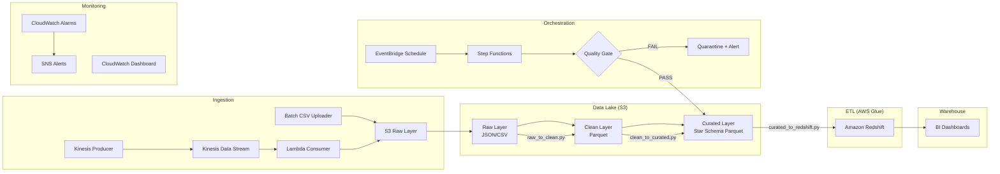

# 🚀 Customer 360 Data Platform

A **production-grade, cloud-native data engineering platform** built on AWS that ingests real-time and batch data, applies layered transformations, models it as a star schema, and serves analytics dashboards — with full orchestration, data quality, monitoring, and Infrastructure as Code.

### 🔗 <a href="https://customer-360-platform-hnsr2z6bpmrqs43d8qnarf.streamlit.app/" target="_blank">Live Demo →</a>


## 📐 Architecture Overview



---

## 🗂️ Project Structure

```
customer-360-platform/
├── config/                          # Centralized pipeline configuration
│   └── pipeline_config.yaml
├── ingestion/                       # Data ingestion layer
│   ├── kinesis/                     # Real-time streaming
│   │   ├── producer.py              # Clickstream event producer
│   │   └── consumer_lambda.py       # Lambda → S3 writer
│   └── batch/                       # Batch uploads
│       └── upload_csv.py            # CSV uploader with multipart
├── data_lake/                       # Data lake management
│   ├── s3_structure.md              # 3-layer architecture docs
│   └── glue_catalog.py              # Glue Data Catalog setup
├── etl/                             # AWS Glue ETL jobs
│   └── glue_jobs/
│       ├── raw_to_clean.py          # Schema enforcement, dedup, normalization
│       ├── clean_to_curated.py      # Star schema dimensions/facts, business logic
│       └── curated_to_redshift.py   # Load to warehouse via COPY + MERGE
├── warehouse/                       # Amazon Redshift
│   ├── ddl/
│   │   ├── create_schema.sql        # Star schema DDL (facts + dimensions)
│   │   └── staging_tables.sql       # Staging tables + upsert procedures
│   ├── queries/
│   │   └── analytics_queries.sql    # 10 production analytics queries
│   └── maintenance/
│       └── vacuum_analyze.sql       # VACUUM, ANALYZE, health monitoring
├── orchestration/                   # Pipeline orchestration
│   ├── step_functions/
│   │   ├── pipeline_state_machine.json  # Full pipeline ASL definition
│   │   └── deploy_state_machine.py      # Deployer script
│   └── eventbridge/
│       └── schedule_rule.py         # Hourly/daily schedule triggers
├── data_quality/                    # Data quality framework
│   ├── schemas/                     # JSON schemas for validation
│   │   ├── clickstream_schema.json
│   │   ├── customer_schema.json
│   │   ├── product_schema.json
│   │   └── transaction_schema.json
│   └── validators/
│       ├── schema_validator.py      # JSON schema validation engine
│       ├── data_checks.py           # Null, dup, range, freshness, referential
│       └── quality_reporter.py      # Report generation + S3 quarantine
├── monitoring/                      # Monitoring & alerting
│   ├── cloudwatch/
│   │   ├── alarms.py                # 7 CloudWatch alarms
│   │   └── dashboards.py           # Operational dashboard
│   └── sns/
│       └── notifications.py        # SNS topic + email subscription
├── security/                       # Security & governance
│   ├── iam/
│   │   ├── policies.json           # Least-privilege IAM policies
│   │   └── roles.py                # IAM role creation
│   ├── encryption/
│   │   └── kms_setup.py            # KMS key with rotation
│   └── s3/
│       └── bucket_policies.json    # S3 bucket policies (enforce encryption)
├── sample_data/                    # Data generators
│   └── generators/
│       ├── generate_customers.py    # 5K customer records
│       ├── generate_products.py     # 200 product catalog
│       ├── generate_transactions.py # 50K transactions
│       └── generate_clickstream.py  # 100K clickstream events
├── terraform/                      # Infrastructure as Code
│   ├── main.tf                     # Root module (all wired together)
│   ├── variables.tf                # Input variables
│   ├── outputs.tf                  # Output values
│   └── modules/
│       ├── s3/main.tf              # S3 buckets with lifecycle
│       ├── kms/main.tf             # KMS encryption key
│       ├── kinesis/main.tf         # Kinesis Data Stream
│       ├── lambda/main.tf          # Lambda + Kinesis trigger + DLQ
│       ├── glue/main.tf            # Glue jobs + catalog + security config
│       ├── redshift/main.tf        # Redshift cluster (VPC, encrypted)
│       ├── step_functions/main.tf  # Step Functions + EventBridge
│       └── monitoring/main.tf      # CloudWatch + SNS
├── tests/
│   └── test_data_quality.py        # Unit tests for quality checks
├── requirements.txt
└── .gitignore
```

---

## ⚙️ Tech Stack

| Layer | AWS Service | Purpose |
|---|---|---|
| **Streaming Ingestion** | Kinesis Data Streams | Real-time clickstream events |
| **Batch Ingestion** | S3 + Python uploader | CSV & bulk file uploads |
| **Data Lake** | S3 (3-layer) | Raw → Clean → Curated |
| **Data Catalog** | AWS Glue Data Catalog | Schema registry & partitions |
| **ETL** | AWS Glue (PySpark) | Distributed data transformations |
| **Warehouse** | Amazon Redshift | Star schema analytics |
| **Orchestration** | Step Functions + EventBridge | End-to-end pipeline workflow |
| **Data Quality** | Custom Python + JSON Schema | Validation, quarantine, reporting |
| **Monitoring** | CloudWatch + SNS | Alarms, dashboards, email alerts |
| **Security** | IAM, KMS, S3 policies | Least privilege, encryption at rest |
| **IaC** | Terraform | Full infrastructure provisioning |

---

## 🚀 Quick Start

### 1. Install Dependencies
```bash
pip install -r requirements.txt
```

### 2. Generate Sample Data
```bash
cd sample_data/generators
python generate_customers.py --count 5000
python generate_products.py --count 200
python generate_transactions.py --count 50000
python generate_clickstream.py --count 100000
```

### 3. Deploy Infrastructure (Terraform)
```bash
cd terraform
terraform init
terraform plan -var-file="dev.tfvars"
terraform apply -var-file="dev.tfvars"
```

### 4. Run Data Quality Tests
```bash
pytest tests/ -v
```

---

## 🔒 Security Features

- **SSE-KMS** encryption for all S3 buckets and Redshift
- **Least-privilege IAM roles** per service (Lambda, Glue, Redshift, Step Functions)
- **S3 bucket policies** deny unencrypted uploads and insecure transport
- **VPC isolation** for Redshift cluster
- **Automatic key rotation** for KMS CMK
- **Public access blocked** on all S3 buckets

---

## 📊 Analytics Queries

The warehouse includes **10 production-ready analytics queries**:
1. Customer Lifetime Value (CLV) with segmentation
2. Monthly revenue trends with MoM growth
3. Cohort retention analysis
4. Product performance matrix
5. Customer churn risk scoring
6. Channel conversion funnel
7. RFM segmentation
8. Product affinity analysis (market basket)
9. Geographic revenue heatmap
10. Time-series demand forecasting base

---

## 📈 Monitoring

The platform includes a CloudWatch dashboard tracking:
- Pipeline execution success/failure rates
- Glue job durations
- Kinesis stream health (incoming records, iterator age)
- Lambda consumer invocations and errors
- Redshift CPU and disk utilization
- S3 data lake growth

---

## 📄 License

This project is for educational and portfolio purposes.
